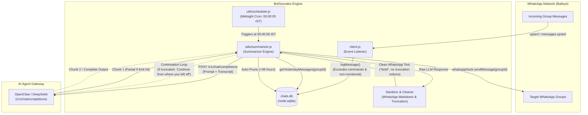

# Daily WhatsApp Chat Summary Architecture

## Overview
BotSocrates automatically records, isolates, summarizes, and cleans daily WhatsApp conversations across specified groups. Every midnight (00:00:05 IST), it aggregates the previous day's conversations, queries the configured AI agent gateway (OpenClaw / OpenAI-compatible endpoint), automatically resolves output token truncations via session continuation, formats the summary cleanly for WhatsApp, and delivers the report to each group independently.

---

## Architecture Diagram

---

## Detailed Step-by-Step Flow

### 1. Message Ingestion & Storage (`chatLogger.js`)
- Every incoming message on WhatsApp is processed by the event handler in `client.js`.
- If the chat belongs to a group in `SUMMARY_GROUP_IDS`:
  - Bot commands (messages starting with prefix `/`) are filtered out.
  - The message is stored in `chats.db` using Node.js built-in `node:sqlite`.
  - Stored fields: `group_id`, `sender_jid`, `sender_name`, `text`, `timestamp` (UTC epoch ms).

### 2. Midnight Scheduler (`utils/scheduler.js`)
- Runs a lightweight recurring timer configured for `00:00:05 AM IST` every night.
- Can also be manually triggered via `POST /trigger-summary` for on-demand generation and testing.

### 3. Isolated Group Querying
- For each group configured in `SUMMARY_GROUP_IDS`:
  - `chatLogger.getYesterdayMessages(groupId, baseDate)` extracts only the messages belonging strictly to that group between 00:00:00 and 23:59:59 IST of yesterday.
  - Groups are processed strictly isolatedly—Group A will never see or leak Group B's discussions.
  - If a group has fewer than 2 messages, summarization is safely skipped.

### 4. AI Gateway & Continuation Loop (`utils/summarizer.js`)
- Constructs a witty, multilingual system prompt supporting English, Hinglish, and Romanized Marathi (Manglish).
- Formats transcript with sender names and readable 12-hour IST timestamps.
- Sends the prompt to OpenClaw (`/v1/chat/completions`).
- **Continuation Handling**:
  - When chats are large (1,000–2,000+ messages), the model's output token limit may be reached.
  - If `finish_reason === 'length'` or if the response includes a truncation banner (`⚠️ Reply truncated at the model's output token limit...`):
    1. The warning banner is stripped from the current text.
    2. A follow-up prompt (`Continue writing from where you stopped. Do not repeat previous text.`) is sent with the conversation history.
    3. The subsequent chunks are stitched together seamlessly (up to 3 continuation rounds).

### 5. WhatsApp Markdown Sanitization
- LLMs often output Markdown double asterisks `**bold**`, or place asterisks inside quotes `*"quote"*`.
- `sanitizeWhatsAppFormatting()` converts markdown bold to WhatsApp single asterisk format `*bold*`.
- Strips any residual truncation notices completely so group members never see token warnings.
- Preserves plain text headers (e.g. keeping `🗞️ Kal Ka Lafda & Gossip (Key Highlights):` unbolded).

### 6. Delivery & Rolling Pruning
- Summary is sent directly and isolatedly to the target group via `whatsappSock.sendMessage(groupId, { text })`.
- A 2-second rate-limit pause is enforced between groups.
- Once all groups are processed, `chatLogger.pruneOldMessages(48)` purges messages older than 48 hours to maintain a lightweight database footprint.
