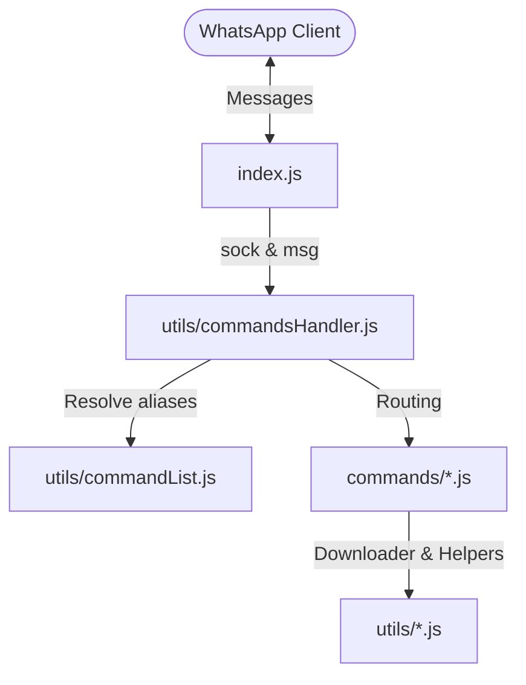

# BotSocrates Project Index

Welcome to the **BotSocrates** codebase developer index. This document serves as a complete map of the codebase to help you understand, modify, and extend the bot.

## 📌 Architecture Overview

BotSocrates is a WhatsApp bot powered by the [@whiskeysockets/baileys](https://github.com/WhiskeySockets/Baileys) library. It handles incoming messages, executes various media conversion and media downloading utility commands, and schedules background cron jobs.



---

## 📂 Codebase Directory Structure

### 📁 Root Directory

*   [index.js](file:///d:/coding2/BotSocrates/index.js) — The main entry point of the application. Initializes the WhatsApp socket connection via `useMultiFileAuthState`, handles connection lifecycle updates (including QR code generation), sets up crons, and forwards incoming messages (`messages.upsert`) to the command handler.
*   [package.json](file:///d:/coding2/BotSocrates/package.json) — Defines metadata, npm scripts (`start`, `clean_start`, `tsc`), and external dependencies.
*   [README.md](file:///d:/coding2/BotSocrates/README.md) — The user-facing documentation detailing environment variables, features, and setup.
*   [.gitignore](file:///d:/coding2/BotSocrates/.gitignore) — Specifies ignored files and folders (e.g. `auth_info_baileys`, cached assets, and `.env`).

---

### 📁 Commands Directory (`/commands`)

Each command module in this folder handles a specific WhatsApp interaction. Most files export `reply`, `replyForCommandWithOption`, and `replyForCommandWithMultiOptions` functions.

*   [alive.js](file:///d:/coding2/BotSocrates/commands/alive.js) — Responds with a simple status message to verify if the bot is online.
*   [ping.js](file:///d:/coding2/BotSocrates/commands/ping.js) — A lightweight infrastructure test that calculates delta latency and returns server status.
*   [help.js](file:///d:/coding2/BotSocrates/commands/help.js) — Constructs and sends the command helper menu. Includes a hidden `"admin"` option placeholder.
*   [sticker.js](file:///d:/coding2/BotSocrates/commands/sticker.js) — Converts incoming or quoted media (Images, GIFs, Videos) into WhatsApp WebP stickers using the `wa-sticker-formatter` library and system `ffmpeg`. Supports options like `crop`, `full`, and `default`.
*   [image.js](file:///d:/coding2/BotSocrates/commands/image.js) — Converts quoted WebP stickers back into standard media (PNG for static stickers, MP4 for animated stickers) using ImageMagick (`magick` or `convert`) and `ffmpeg`.
*   [tts.js](file:///d:/coding2/BotSocrates/commands/tts.js) — Text-to-speech engine. Invokes `gtts_script.py` to compile text to MP3 and uses `ffmpeg` to transcode it to a WhatsApp-compatible Opus OGG file.
*   [shortener.js](file:///d:/coding2/BotSocrates/commands/shortener.js) — Shortens any provided URL using the TinyURL API.
*   [text_overlay.js](file:///d:/coding2/BotSocrates/commands/text_overlay.js) — Adds custom text overlay centered at the bottom of a quoted image/sticker using ImageMagick commands.
*   [del.js](file:///d:/coding2/BotSocrates/commands/del.js) — Deletes a previously sent message by quoting it (only allowed for authorized admin participants).
*   [naughty.js](file:///d:/coding2/BotSocrates/commands/naughty.js) — Sends a predefined cheeky sticker from local assets.

---

### 📁 Utilities Directory (`/utils`)

Shared utilities, helper scripts, and application logic.

*   [commandsHandler.js](file:///d:/coding2/BotSocrates/utils/commandsHandler.js) — The primary command router. Checks if the incoming message starts with `process.env.PREFIX`, strips the prefix, extracts parameters, and invokes the matching command function based on argument counts.
*   [commandList.js](file:///d:/coding2/BotSocrates/utils/commandList.js) — Acts as a command registry mapping triggers and aliases (e.g. `h` -> `help`, `speak` -> `tts`) to the exported command functions.

*   [error.js](file:///d:/coding2/BotSocrates/utils/error.js) — Formats and sends standard Internal Server Error (500) messages.
*   [gtts_script.py](file:///d:/coding2/BotSocrates/utils/gtts_script.py) — Python script using the `gtts` library to generate MP3 speech files from text inputs.

---

### 📁 Containerization & Deployment
*   [Dockerfile](file:///d:/coding2/BotSocrates/Dockerfile) — Standardized Debian-based multi-runtime configuration that compiles system packages (Node.js, Python 3, pip, ffmpeg, imagemagick, gtts) needed by the bot.
*   [docker-compose.yml](file:///d:/coding2/BotSocrates/docker-compose.yml) — Orchestrates the bot container and a local MongoDB instance.
*   [.env.example](file:///d:/coding2/BotSocrates/.env.example) — Template configuration file outlining the required environment variables.
*   [.dockerignore](file:///d:/coding2/BotSocrates/.dockerignore) — Excludes local dependencies, runtime logs, and sensitive credentials from the build process.

---

## 🛠️ Key Dependencies & System Requirements

To develop or run the bot successfully, the following system-level and library prerequisites must be satisfied:

1.  **Node.js**: The codebase uses modern JavaScript and packages defined in `package.json`.
2.  **FFmpeg**: Used for video sticker transcoding, audio conversion for text-to-speech, and video formatting. Set the path to the executable in your environment variables via `FFMPEG_PATH`.
3.  **ImageMagick**: Required for static/animated sticker conversions and overlaying text (`commands/image.js` and `commands/text_overlay.js`). The script executes standard commands using `magick` or `convert` executable.
4.  **Python 3**: Requires Python and the `gtts` library (`pip install gtts`) to execute the text-to-speech engine wrapper.


---

## 🐳 Containerization with Docker & Portainer

To deploy BotSocrates onto your server with Portainer:

### 1. Configure the Environment
Copy the [.env.example](file:///d:/coding2/BotSocrates/.env.example) file to a `.env` file:
```bash
cp .env.example .env
```
Fill out the required variables. By default, configuration is loaded from the environment or `.env` file.

### 2. Deploy using Docker Compose (or Portainer Stacks)
Run the following command in the root folder:
```bash
docker compose up -d --build
```
Or in **Portainer**:
1. Go to **Stacks** > **Add stack**.
2. Paste the contents of [docker-compose.yml](file:///d:/coding2/BotSocrates/docker-compose.yml) into the Web editor.
3. Define the environment variables listed in [.env.example](file:///d:/coding2/BotSocrates/.env.example) in the Portainer environment variable fields.
4. Click **Deploy the stack**.

### 3. Scan the WhatsApp Web QR Code
Because the bot operates headlessly, it prints the authentication QR code directly to standard output.
1. In Portainer, click on the **socrates-bot** container.
2. Open the **Container Logs**.
3. Scan the rendered terminal QR code with your phone's WhatsApp Web scanner to establish the session.
4. **Note:** To prevent `405 Connection Failure` crash loops from stale WhatsApp sessions, the Docker container is configured to clear the `./auth_info_baileys` keys on every startup. You will need to re-scan the QR code each time the container restarts.

---

## 💡 Command Routing Specification

When a command is received on WhatsApp, the payload is matched in [commandsHandler.js](file:///d:/coding2/BotSocrates/utils/commandsHandler.js#L46-L100):

*   **No arguments**: Resolves to the `.reply(sock, msg)` method on the matching command.
*   **One argument**: Resolves to the `.replyForCommandWithOption(sock, msg, option)` method.
*   **Multiple arguments**: Joins all arguments with spaces and forwards them to `.replyForCommandWithMultiOptions(sock, msg, multicommand)`.

